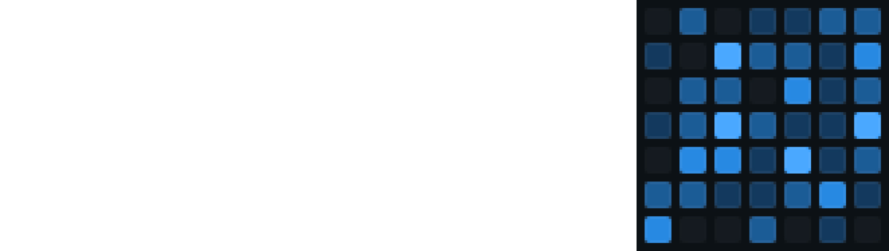

<h2 align="center"></h2>

### <p align="center">Coding problems to practice problem solving skill.</p>

<div align="center">
    <p>
	    <a name="stars"></a>
      <a name="Forks"></a>
	    <a name="contributions"></a>
	    <a name="license"></a>
    </p>
</div>

## Topics

- [Algorithms](./contents/algorithms/home.md)
- [Data Structures](./contents/data-structures/home.md)
- [Mathematics](./contents/mathematics/home.md)
- [freeCodeCamp](./contents/freeCodeCamp/home.md)
- [Hackerrank](./contents/hackerrank/home.md)

## Info

<p>The problems follow this folder and file structure:</p>

```js

  Contents = {
    topic_name: [
      "home.md",
      problem_folder [
        "problem.md",
        "solution.js"
      ],
      other_problem_folder [
        "problem.md",
        "solution.js",
        "solution.cpp"
      ],
    ]
  }

```
<p>Notes</p>

- The "problem.md" files bring the information about the problem with a broader view, in this file you will not see solutions explained, only links to them in different programming languages.
- The "solution.js" files don't have to be just javascript, you can send a #pr with a solution in another programming language.

## Contribution

<p>Feel free to contribute to this repo by raising the pull request.</p>

# 

<p align="center">Give the repository one 🌟!<p>
