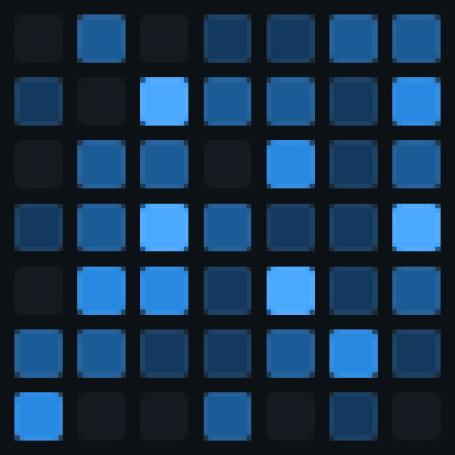
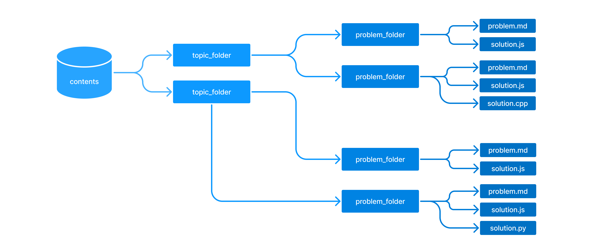

<h1 align="center">
  
  Coding Problems
</h1>

    

	    
	    
	    
	    
    

## Fundamentals 🎓

<table>
  <tbody>
    <tr>
      <td align="center"><a href="./contents/algorithms/home.md">Algorithms</a></td>
      <td align="center"><a href="./contents/data-structures/home.md">Data Structures</a></td>
      <td align="center"><a href="./contents/mathematics/home.md">Mathematics</a></td>
      <td align="center"><a href="./contents/regex/home.md">Regex</a></td>
    </tr>
    <tr>
      <td align="center"><a href="./contents/frontend/home.md">Frontend</a></td>
      <td align="center"><a href="./contents/backend/home.md">Backend</a></td>
      <td align="center"><a href="./contents/debugging/home.md">Debugging</a></td>
      <td align="center"><a href="./contents/refactoring/home.md">Refactoring</a></td>
    </tr>
    <tr>
      <td align="center"><a href="./contents/functional-programming/home.md">Functional Programming</a></td>
      <td align="center"><a href="./contents/dynamic-programming/home.md">Dynamic Programming</a></td>
      <td align="center"><a href="./contents/computer-science/home.md">Computer Science</a></td>
      <td align="center"><a href="./contents/coding-interview/home.md">Coding Interview</a></td>
    </tr>
    <tr>
      <td align="center"><a href="./contents/competitive-programming/home.md">Competitive Programming</a></td>
      <td align="center"><a href="./contents/computer-networks/home.md">Computer Networks</a></td>
      <td align="center"><a href="./contents/rosetta-code/home.md">Rosetta Code</a></td>
      <td align="center"><a href="./contents/puzzles/home.md">Puzzles</a></td>
    </tr>
  </tbody>
</table>

## Niches 📚

<table>
  <tbody>
    <tr>
      <td align="center">JavaScript</td>
      <td align="center">TypeScript</td>
      <td align="center">APIs</td>
      <td align="center">Databases</td>
    </tr>
    <tr>
      <td align="center">Responsive Design</td>
      <td align="center">CSS</td>
      <td align="center">Accessibility</td>
      <td align="center">Figma</td>
    </tr>
  </tbody>
</table>

## Info 📌

Project focused on helping developers and enthusiasts like me to practice their logic and problem solving skills. In this repository you should find various problems related to algorithms, data structure, mathematics, computer science problems, regex and many others.

Notes:

- The "problem.md" files bring the information about the problem with a broader view, in this file you will not see solutions explained, only links to them in different programming languages.
- The "solution.js" files don't have to be just javascript, you can send a #pr with a solution in another programming language.

The problems follow this folder and file structure:

  

## Contribution 🤯

Feel free to contribute to this repo by raising the pull request.

## License 🔖

Licensed under the <a href="./LICENSE">MIT</a> license.

<h2></h2>

Give the repository 🌟
